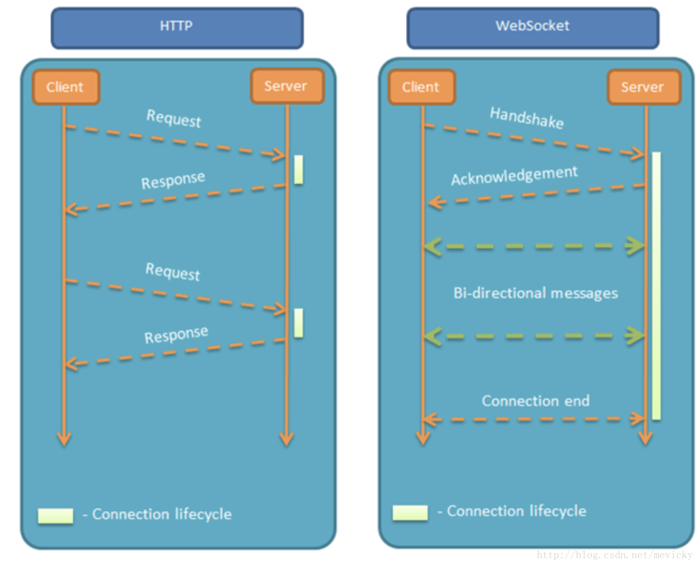

# 1.websocket介绍

* WebSockets API是HTML5开始提供的一种浏览器与服务器进行全双工通讯的网络技术
* 通俗地讲：在客户端和服务器保有一个持久的连接，两边可以在任意时间开始发送数据
* 属于应用层协议，它基于TCP传输协议，并复用HTTP的握手通道



# 2.websocket实战

* server.js

```js
const { Server } = require('ws');
const wss = new Server({ port: 8888 });
wss.on('connection', (socket) => {
    socket.on('message', (message) => {
        socket.send(message);
    });
});
```

* client

```html
<!DOCTYPE html>
<html lang="en">
<head>
  <meta charset="UTF-8">
  <meta http-equiv="X-UA-Compatible" content="IE=edge">
  <meta name="viewport" content="width=device-width, initial-scale=1.0">
  <title>Document</title>
</head>
<body>
  <input type="text" id="text">
  <button onclick="send()">发送</button>
  <script>
    let text = document.getElementById('text')
    // 在浏览器里连接服务器
    let socket = new WebSocket('ws://localhost:8888')
    // 当连接打开或建立连接后触发回调
    socket.onopen = function() {
      console.log(`客户端的onopen事件`)
      socket.send('客户端的socket.send')
    }
    // 客户端收到的服务器的消息
    socket.onmessage = function(event) {
      console.log(`客户端收到的message：${event.data}`)
      // socket.send(`客户端收到的message：${event.data}`)
    }
    function send() {

      let value = text.value
      text.value = ''
    }
  </script>
</body>
</html>
```

# 3.websocket连接

* WebSocket复用了HTTP的握手通道
* 具体指的是,客户端通过HTTP请求与WebSocket服务端协商升级协议
* 协议升级完成后,后续的数据交换则遵照WebSocket的协议

### 3.1 客户端：申请协议升级

* 首先客户端发起协议升级请求
* 请求采用的是标准的HTTP报文格式，且只支持GET方法

```
GET ws://localhost:8888/ HTTP/1.1
Host: localhost:8888
Connection: Upgrade
Upgrade: websocket
Sec-WebSocket-Version: 13
Sec-WebSocket-Key: IHfMdf8a0aQXbwQO1pkGdA==
```

### 3.2 服务端：响应协议升级

* 服务端返回内容如下：状态代码101表示协议切换
* 到此完成协议升级，后续的数据交互都按照新的协议来

```
HTTP/1.1 101 Switching Protocols
Upgrade: websocket
Connection: Upgrade
Sec-WebSocket-Accept: aWAY+V/uyz5ILZEoWuWdxjnlb7E=
```
| 字段 | 含义 |
| - | - |
| Connection: Upgrade | 升级协议 |
| Upgrade: websocket | 升级到websocket协议 |
|Sec-WebSocket-Accept | Accept字符串 |

### 3.3 Sec-WebSocket-Accept的计算

* Sec-WebSocket-Accept根据客户端请求首部的Sec-WebSocket-Key计算出来
* 计算公式为：

```
将Sec-WebSocket-Key跟258EAFA5-E914-47DA-95CA-C5AB0DC85B11拼接

通过SHA1计算出摘要，并转成base64字符串
```

```js
const crypto = require('crypto');
const CODE = '258EAFA5-E914-47DA-95CA-C5AB0DC85B11';
function toAcceptKey(wsKey) {
  return crypto.createHash('sha1').update(wsKey + CODE).digest('base64');
}
const webSocketKey = 'IHfMdf8a0aQXbwQO1pkGdA==';
console.log(toAcceptKey(webSocketKey)); // aWAY+V/uyz5ILZEoWuWdxjnlb7E=
```

# 4.数据帧格式

* WebSocket客户端、服务端通信的最小单位是帧，由1个或多个帧组成一条完整的消息（message）
* 发送端 将消息切割成多个帧，并发送给服务端
* 接收端 接收消息帧，并将关联的帧重新组装成完整的消息

# 5.实现websocket服务器